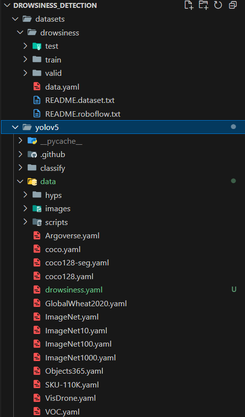

# Brief description

Human drowsiness detection with YoloV5.


## Getting started

Train model with Single GPU
```bash
    python train.py --img 416 --epochs 50  --batch 64 --data drowsiness.yaml --weights yolov5s.pt --device 0
```
Train model with Multiple GPU
```bash
    python -m torch.distributed.run --nproc_per_node 2 train.py --batch 64 --img 416 --epochs 50 --data coco.yaml --weights yolov5s.pt --device 0,1
```
## Datasets folder setup


## Link to dataset

(VKU's email access only)
[Drowsiness dataset](https://drive.google.com/file/d/1ssQHltSSEQBS7QeYxeRDU1-pV945O1Da/view?usp=sharing)
